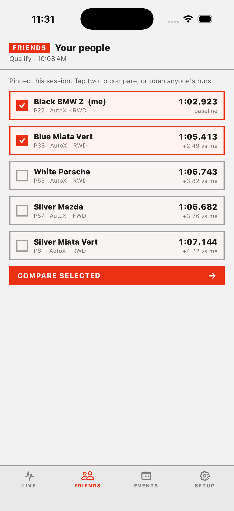
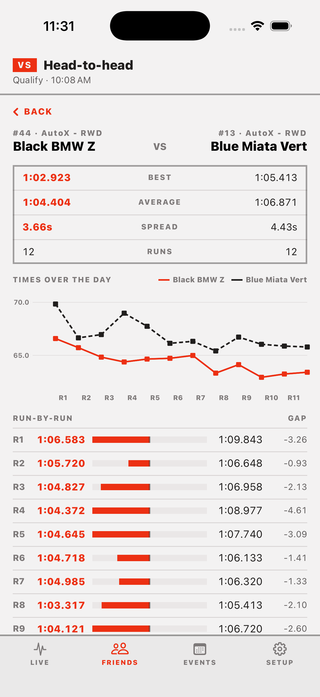
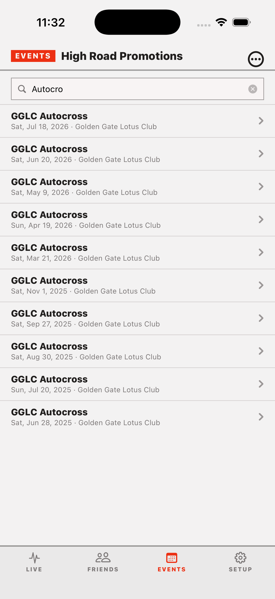
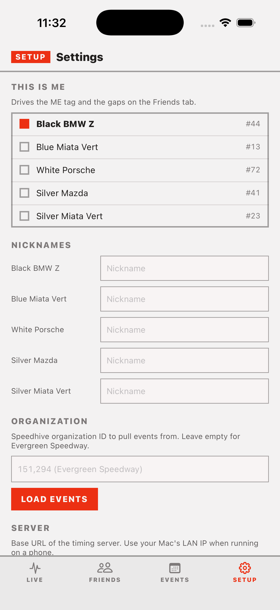

# Evergreen AutoX App

Live timing and results for Evergreen AutoX in your pocket. A SwiftUI iOS app backed by a small FastAPI server that wraps the MyLaps Speedhive API (via [speedhive-tools](https://github.com/cosmoslab58/speedhive-tools)), with bonus support for Golden Gate Lotus Club autocross results scraped from gglotus.org.

## Screenshots

| Live timing | Friends | Head-to-head |
| :---: | :---: | :---: |
|  |  |  |

| Events | Settings |
| :---: | :---: |
|  |  |

## The app

Four tabs:

- **Live** — the leaderboard for the selected session: position, car number, best time, and run count for every entry. Your own car gets a **ME** tag and highlight, and you can star cars to keep an eye on them. Pull to refresh.
- **Friends** — pin the cars you care about, see everyone's gap to your best time, and pick any two for a head-to-head: best/average/spread stats, a times-over-the-day chart, and a run-by-run gap breakdown.
- **Events** — browse and search an organization's events, then drill into sessions and individual drivers.
- **Setup** — mark which car is you (drives the ME tag and the gaps on the Friends tab), give cars nicknames, switch Speedhive organizations, and point the app at your server.

## Running the server

```bash
./start.sh
```

One command for both development and deployment. The first run asks you to choose a leaderboard admin username and password (saved to `.env`, which is gitignored). Then, if Docker Compose is installed, it builds the image and starts the server detached on port 8321 with `restart: unless-stopped`; otherwise it creates a virtualenv, installs dependencies, and runs the server in the foreground. Redeploying is `git pull && ./start.sh`.

```bash
./start.sh local
```

Forces the virtualenv path even when Docker is installed, which is faster for iterating on the server code. `python server/app.py` also works once `.venv` exists, but it does not read `.env`, so export the variables yourself.

The public server is https://autox.romangarms.com, which is what the app uses by default. The server itself speaks plain HTTP on port 8321; TLS is terminated by a reverse proxy in front of it, so the app's transport security settings only allow insecure HTTP for local-network addresses.

The server binds to `0.0.0.0` on purpose: when developing, set the app's server URL (Setup tab) to your Mac's LAN IP so your iPhone can reach it.

Open http://localhost:8321/ for a bare-bones dev console: a leaderboard editor, a Speedhive browser (enter an org ID, the number in the org's URL on speedhive.mylaps.com, then click through events → sessions → drivers), and a GGLC results browser.

### Leaderboard edit auth

Reading the leaderboard is public. Creating, editing, or deleting courses and runs requires HTTP Basic auth with the credentials from `.env`:

| Variable | Meaning |
| --- | --- |
| `LEADERBOARD_ADMIN_USER` | Username, defaults to `admin` |
| `LEADERBOARD_ADMIN_PASSWORD` | Required; with it unset every write endpoint returns 503 |

To change them:

```bash
./start.sh set-password
./start.sh             # restart so the server picks them up
```

The dev console asks for the login in a dialog on the first edit (or via the Sign in button in the header) and keeps it for the browser session. From the command line, use `curl -u admin:PASSWORD`.

`./start.sh help` lists all commands.

## API endpoints

Speedhive-backed:

- `GET /api/orgs/{org_id}` — org info
- `GET /api/orgs/{org_id}/events?limit=&offset=` — events
- `GET /api/events/{event_id}/sessions` — sessions for an event
- `GET /api/sessions/{session_id}/results` — raw classification
- `GET /api/sessions/{session_id}/laps` — raw laps (grouped per finish position)
- `GET /api/sessions/{session_id}/drivers` — distilled driver list
- `GET /api/sessions/{session_id}/drivers/{position}` — one driver's raw result + laps

GGLC (scraped from gglotus.org result pages):

- `GET /api/gglc/events` — list of GGLC autocross events
- `GET /api/gglc/events/{event_date}` — full results for one event (`YYYY-MM-DD` or `YYYYMMDD`)

Custom leaderboard (SQLite in `server/leaderboard.db`; writes need Basic auth):

- `GET /api/leaderboard/courses` — courses
- `POST /api/leaderboard/courses` — create a course (`name`, optional `distance_miles`, `legacy_distance_miles`)
- `GET /api/leaderboard/courses/{course_id}` — course plus its runs sorted by adjusted time
- `PATCH` / `DELETE /api/leaderboard/courses/{course_id}` — edit or delete a course (deleting removes its runs)
- `POST /api/leaderboard/courses/{course_id}/runs` — add a run (`driver`, `time` as seconds or `m:ss.mmm`, optional `vehicle`, `hp`, `top_speed_mph`, `run_date`, `time_of_day`, `conditions`, `legacy`, `notes`)
- `PATCH` / `DELETE /api/leaderboard/runs/{run_id}` — edit or delete a run

Legacy runs were set on the old, longer course; their adjusted time is scaled by `distance_miles / legacy_distance_miles`. Average speed is computed from the course distance.

TrackAddict:

- `POST /api/trackaddict/parse` — body is a raw TrackAddict CSV log; returns its laps with times and distances

`server/import_sheet.py` seeds the leaderboard from the HWY 9 Leaderboard spreadsheet snapshot embedded in the script and is safe to re-run.

Laps in the Speedhive API are keyed only by finish position within a session, so drivers are addressed by `position`.
